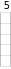
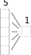
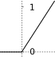
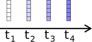
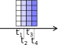
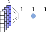

---
jupyter:
  jupytext:
    text_representation:
      extension: .md
      format_name: markdown
      format_version: '1.3'
      jupytext_version: 1.14.4
  kernelspec:
    display_name: Python 3.10.6 64-bit
    language: python
    name: python3
---

# Spiking neurons in PyTorch

Norse is a library where you can *simulate* neural networks that are driven by atomic and sparse events **over time**, rather than large and dense tensors *without* time.

This notebook shows you how how to install and use PyTorch and Norse. We will skip most of the details, and *we will not cover training*. Many more resources exist in our [notebook repository](https://github.com/norse/notebooks) if you're feeling adventurous. Also, our documentation tells you much more about what Norse is and why we built it at: https://norse.github.io/norse/

:::{note}
You can execute the notebooks on this website by hitting <i class="fas fa-rocket"></i> above and pressing <i class="fas fa-play"></i> Live Code.
:::

## Table of contents

1. Using PyTorch
  1. Installation
  2. Creating a data and a network
  3. Applying data to the network
2. Using Norse
  1. Creating temporal data
  2. Creating a spiking network
  3. Applying data to the network
3. Next steps


# Something cool


---

# 1. Using PyTorch

## 1.1 Installing prerequisites

Before we can get started, we need to install the necessary software. But! That's simple. Just run the cell below.

```python
!pip install --quiet norse
```

Now that it's installed, we can import PyTorch and Norse directly into Python.

```python
import torch
import norse.torch as norse

# We set the random seed for reproducibility
_ = torch.manual_seed(0)
```

## 1.2.1 Creating data with PyTorch

First, we need some **data**. Let's start by creating a vector of 5 random numbers, that can be visualized like this.



```python
data = torch.randn(5)
data
```

## 1.2.2 Creating a network

We will now create a simple neural **network** in PyTorch, consisting of a `Linear` layer and an *activation function*. The `Linear` layer combines the five inputs into a single output, like so:



The activation *activation function* determines *how* the neurons react to the data. For now, we will just use a [simple rectified linear unit (ReLU)](https://pytorch.org/docs/stable/generated/torch.nn.ReLU.html), which clips data data to the interval $[0, \inf)$. If the data is below 0, the *activation function* returns 0. If the data is above zero, ReLU returns that same data without change (identity).



Now that we installed the ReLU *activation function*, our network looks like this:


Finally, we need to put the two *layers* together by wrapping them in a `torch.nn.Sequential` module.

```python
network = torch.nn.Sequential(torch.nn.Linear(5, 1), torch.nn.ReLU())
```

Together, our data and network now looks like this:


## 1.3 Using the network

It's now straight forward to give the **network** our **data**. That will give us a single number as output, but with any negative numbers zero'ed out because the ReLU layer removes them.

```python
network(data)
```

Try to run the cell multiple times - you should get the same result. Why? Because the input never changes. So, what happens if the input changes?

Below, we'll use the **network** again, but with a different input vector. Try running it several times. Do you understand what is happening? Why is it sometimes zero?

```python
data = torch.rand(5)
network(data)
```

# 2. Using Norse

Now that we've seen how to use networks and data in PyTorch, we can extend the same principle to Norse. But before we do that, we need to discuss time.

Neurons in biology receive data more than that single vector we used above. They exist in time and have intricate dynamics. What you see below is a small animation of a **constant** input that produces different outputs **over time**.


## 2.1 Describing "time"

In order to *simulate* our neuron over time we need be able to express "time".
There are [many ways to approach this](https://en.wikipedia.org/wiki/Dynamical_system) and in Norse, this is approached by discretizing time into small bins.
That is, "time" in Norse is not continuous.
It consists of small "steps" that are very very small (1ms by default).

Practically speaking, we can approach this by creating multiple versions of our **data** vector. Each "version" would then represent one timestep, like in the above simulation.



One way to represent that would be to create a **single matrix**, where each "slice" represents a timesteps.



In PyTorch, we can create such a matrix by adding four timesteps as the outer dimension.

```python
data = torch.randn(4, 5)
data
```

## 2.2 Creating a spiking network

As you remember, the ReLU function isn't spiking or even biological. That's where Norse comes in. Norse includes spiking neuron models that we can add directly into the previous network description. In this case, we'll use a leaky integrate-and-fire (LIF) model.

```python
network = norse.SequentialState(torch.nn.Linear(5, 1), norse.LIF())
```

You probably noticed that we are no longer using the `torch.nn.Sequential` but `norse.SequentialState`. The reason is that every time we feed in one timestep, we also need to *remember* how "excited" the neuron is. This is also known as the *state* of the neuron. `torch.nn.Sequential` doesn't know anything about states, so we need to patch it. We will ignore this for now, but you are welcome to [read more about state handling in our documentation](https://norse.github.io/norse/pages/working.html).

With time, our network can be visualized like this:




Note the two changes: the are using *several* input data vectors and the ReLU *activation function* is replaced with a LIF *activation function*.


## 2.3 Applying data to the network

Applying the data is as simple as we did above. We would now expect that for each timestep, we would get a single output in return (just as before). Because we have four timesteps, we would expect 4 numbers:

```python
output, _ = network(data)  # We ignore the state for now, see above
output
```

As promised, here are exactly the four values we would expect.

Before we conclude, we encourage you to play around with the data above. Here are some leading questions

* How do you simulate the network for 10 timesteps?
* How do you increase the number of neurons from 1 to 2?
* What happens if you add a linear layer in the end that goes from 1 to 3 neurons?


<!-- #region -->
# 3 Next steps

You may wonder why the data above are all zeros. Take a look at this animation.


If the input is too low (like in the left panel), nothing will happen: the neuron stays silent. If we want the network to provide a certain output *we need to train it*. That is the topic for future notebooks and documentation. Specifically, we would recommend these notebooks

* How to train a single spiking neuron with Norse: [](https://colab.research.google.com/github/norse/notebooks/blob/master/single-neuron-experiments.ipynb)
* How to work with state and time in Norse [](https://colab.research.google.com/github/norse/notebooks/blob/master/introduction-to-norse.ipynb)
* How to work with event-based datasets with Tonic: [](https://colab.research.google.com/github/norse/notebooks/blob/master/poker-dvs_classifier.ipynb)

Much more informtion can be found in our [notebooks](https://github.com/norse/notebooks) and the [Norse documentation](https://norse.github.io/norse/index.html). Good luck!
<!-- #endregion -->
